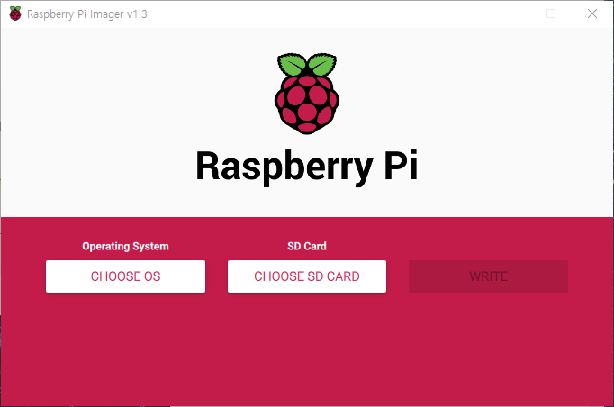

# Creating Deeptcar SD Card Image 

## Step 1. Installing Raspberry pi OS image on SD card 

1. Download the lates version of [Raspberry Pi Imager](https://www.raspberrypi.org/software/) and install it. 
2. Connect an SD card reader with the SD card inside,
3. Open Raspberry pi Imager and choose the required OS from tje list presented.

4. Choose the SD card you wish to write your image to.
5. Click 'WRITE' to begin writing data to the SD card. 

> To use other tools, refer [here](https://www.raspberrypi.org/documentation/installation/installing-images/)

## Step 2. Booting Raspberry pi using monitor and USB keyboard/mouse
1. Insert the SD card into the microSD card slot underside of Raspberry pi. 
2. Connect USB keyboard and mouse to USB connector.
3. Connect monitor using HDMI cable.
4. Plug the power using USB-C cable. 

> Do not plug the power from PC USB. Because PC USB connector can not provide enough current for Raspberry pi. 

At this stage, you can see following view on monitor. 

